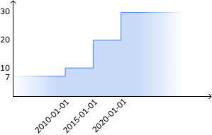

# Rules
- It should take you less than an hour to complete
- No external libraries can be used
- You need to implement functions `valueAt` and `add` from file `history.ts` so that all tests from `npm test` passes
- It is recommended to start implementing `valueAt` first, but that is not enforced in any way
- You cannot change the signature of functions `valueAt` and `add` or change the tests

# Install
```
npm i
```

# Context
We are playing with histories, they can be seen as the balance of a bank account
over time. A graphical representation might look like this:



## Data structure
We map histories in memory using an object. The history above is mapped as:
```js
const history: History<number> = {
  defaultValue: 7,
  steps: [
    { date: '2010-01-01', value: 10, },
    { date: '2015-01-01', value: 20, },
    { date: '2020-01-01', value: 30, },
  ],
}
```
On top of typing (all types are specified in `history.ts`), the system also guarantees that:
- `steps` is sorted by `date` (ascending order)
- `steps` has no duplicates on `date` (a graph cannot have two values for the same date)
- `date` is a string formatted in ISO for easy comparison. We do **not** use `Date` objects.

This means that your implementation of `valueAt` and `add` can rely on the fact that all parametters are typed
correctly and that the above rules are true.

## Reading values from a history
We can read the value of a history at any date. Here are a few examples using the history above:
- `1850-01-01`: 7
- `2009-12-31`: 7
- `2010-01-01`: 10
- `2017-01-01`: 20
- `2099-01-01`: 30

Note that it extends to infinity in both directions on the time axis as shown on the visual representation.
For the particular case of a bank account, $0 would be a more appropriate
default value, it does not make sense to have $7 by default. You are right. But we are building
something generic that should work with any value!

## Adding histories together
We can add any number of histories together to produce a single history.
A good mental representation would be a person having two bank accounts (two histories),
and we would want to find out how much money does that person have over time in total
(only one history).
The value of the output at any given date should be the sum of all histories at
that same date.

The produced history should follow the same rules specified above: steps should not have duplicate dates an so on...

# Tips
- You can use lodash or any other library to try things out quickly, but you have to remove it at the end
- Make something that works first, then clean up your code for a code review
- Since we use strings for dates and not `Date` object it is very simple to compare dates:
  ```js
  '2020-01-01' === '2020-01-01' // => true
  '2020-01-01' > '2010-01-01' // => true
  '2020-01-01' < '2010-01-01' // => false
  ```
- You can use or not use data structures such as `Map` or `Set` as long as you can justify your choices
